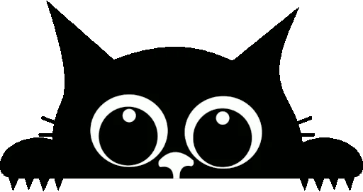

  
  

    <h1>Hey~ I'm Ahmad! 👋</h1>
    
<i>Just someone who wants to continue to be enthusiastic about learning</i>

  

---

### 📊 My GitHub Stats

  
   
  
   
  

  <i>These visual stats represent your coding journey on GitHub: contribution streaks, languages used, and overall activity. They update automatically based on your public GitHub activity.</i> 
  <i>Want to boost them? Stay active, contribute consistently, and share meaningful code!</i>

---

### 💬 Let's Connect

<i>Have feedback, ideas, or just want to say hi? Feel free to reach out! Let’s be friends 🌟</i>

  
  
  

